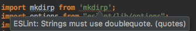
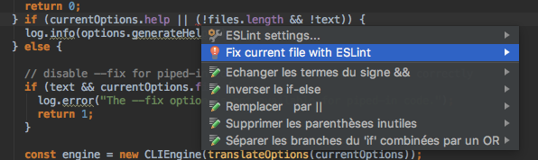
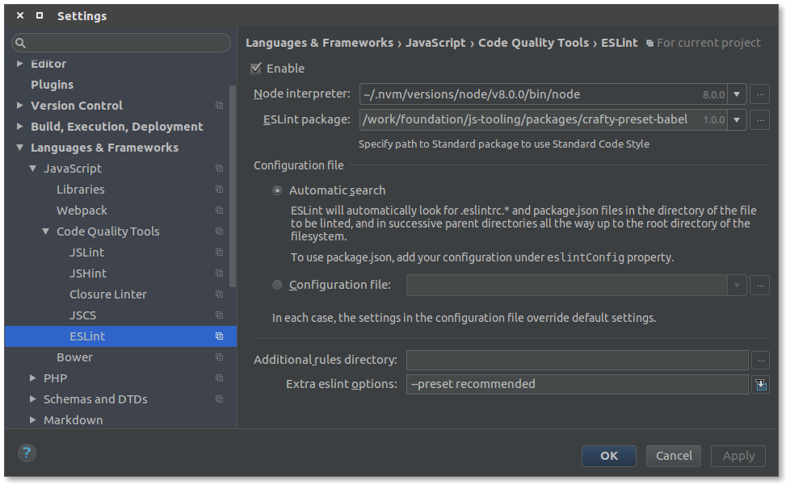

[TOC]

## IntelliJ IDEA : in-editor linting

With in-editor linting you can lint your files while linting and also fix some errors automatically with `alt`-`enter`.

Ensure you have the `ESLint` plugin in your IDE.

This can be changed per-project, the important options are :

* Enable: √
* Node Interpreter : either use the one on your system or the one in your project (generally `src/main/frontend/node/node`)
* ESLint Package : point to your `crafty-preset-babel` package (generally `node_modules/crafty-preset-babel/`)
* Extra ESLint options : Here you choose the presets you want to apply. See below

### Presets

* `format` Base formatting rules, should work on any code (included in `legacy` and `recommended`)
* `node` Adds environment information for Node.js
* `legacy` For all your EcmaScript 5 code
* `recommended` For al your EcmaScript 2015+ code, also contains rules for React

You can use the number of presets you wish, the `format` preset is the one checked by the hooks

You can define them with `--preset {presetName}`

For example running with `--preset recommended` will verify for formatting, common rules, EcmaScript 2015+ specific and React specific rules.
